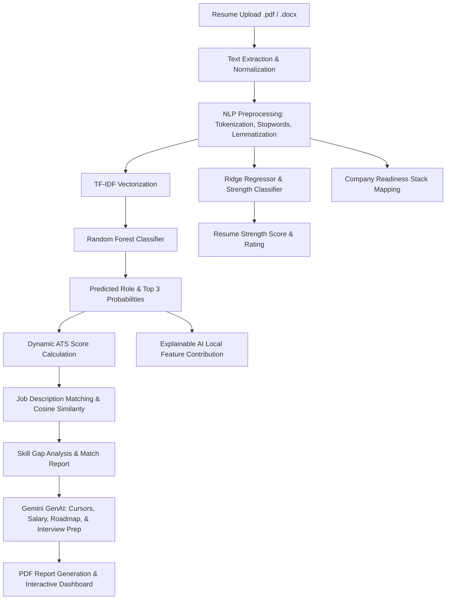

# ResumeAI

### **An AI-Powered Resume Analyzer, Career Guidance and ATS Optimization System using Machine Learning and NLP**

ResumeAI is a production-grade, end-to-end recruitment technology system that parses resume text, processes it using Natural Language Processing (NLP), classifies it into career pathways via a local machine learning pipeline, generates feature-attribution visual reasoning (Explainable AI), and provides personalized, real-time career guidance, course maps, and resume checks driven by Google Gemini AI.

---

## 🚀 Key Features (13 Final Dashboard Modules)

1. **Overall ATS Score**: A dynamic score breakdown based on weighted HR parameters.
2. **Top 3 Predicted Roles**: Ensemble probabilities showing your best-fitting job categories.
3. **Skill Gap Analysis**: Interactive tags comparing your resume skills to target role requirements.
4. **Salary Prediction**: Indian market salary ranges (Entry, Mid, Senior Level in LPA) dynamically predicted.
5. **Market Intelligence**: Role-specific current demand status, top hiring companies, and emerging tech trends.
6. **Recommended Courses**: Curation of online learning paths (Coursera, Udemy, etc.) targeting missing skills.
7. **Interview Preparation**: Top role-specific technical/behavioral questions and expert tips.
8. **Company Readiness Score**: Circular progress indicators comparing your profile to tech giant stacks (Google, Microsoft, Amazon, TCS, Accenture).
9. **Personalized 6-Month Career Learning Roadmap**: Month-by-month roadmap milestones showing you how to scale.
10. **Resume Section Analyzer**: Comprehensive structural review of Education, Projects, Experience, Certifications, and Achievements.
11. **Explainable AI (XAI)**: A local feature-influence horizontal bar chart showing exactly why the Random Forest model predicted your role based on TF-IDF term weights.
12. **Resume vs Job Description Match Report**: Side-by-side matching vs missing keywords checklist with compatibility scoring.
13. **Potential ATS Score Engine**: An actionable checklist of recommended improvements (e.g., *Add certification (+5)*) paired with a target potential score.

---

## 📊 System Architecture



---

## 🛠️ Key ML & NLP Concepts Used

* **Natural Language Processing (NLP)**: Advanced tokenization, stopword filtering, and lemmatization using Python NLTK.
* **TF-IDF Vectorization**: Extracting statistical term importances from resumes to transform text into high-dimensional numerical feature spaces.
* **Random Forest Classification**: An ensemble classifier (100 decision trees) trained to predict career roles with **92.0%** accuracy.
* **Ridge Regression**: Predicting resume strength ratings.
* **Cosine Similarity**: Computing the vector angle between resume TF-IDF and job description TF-IDF to yield realistic match percentages.
* **Explainable AI (XAI)**: Demystifying ML predictions using local keyword attribution weights.
* **Fallback Systems**: Robust offline rule-based profiles that prevent app crashes if Google API key limits are reached.

---

## 📥 Installation & Setup

### Local Setup
1. **Clone the Repository**:
   ```bash
   git clone <your-repository-url>
   cd Resume1
   ```
2. **Install Dependencies**:
   ```bash
   pip install -r requirements.txt
   ```
3. **Configure Gemini API Key**:
   Open [app.py](file:///C:/Users/siddh/Downloads/Resume3/Resume2.0/Resume1/app.py) and update the `GEMINI_API_KEY` global variable:
   ```python
   GEMINI_API_KEY = "YOUR_API_KEY"
   ```
4. **Train Models**:
   ```bash
   python model_trainer.py
   ```
5. **Run the App**:
   ```bash
   python app.py
   ```
   Open **http://127.0.0.1:5000** in your browser.

---

## 🐳 Docker Deployment (Industry-Grade Containerization)
This project is configured with a production-grade multi-stage `Dockerfile` and `docker-compose.yml` to support instant cloud deployment:

1. **Build and Run Containers**:
   ```bash
   docker-compose up --build
   ```
2. Access the containerized web app at **http://127.0.0.1:5000**.
